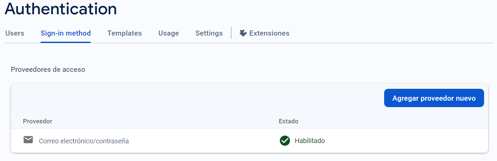
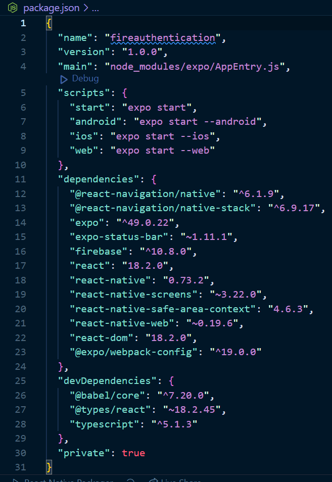
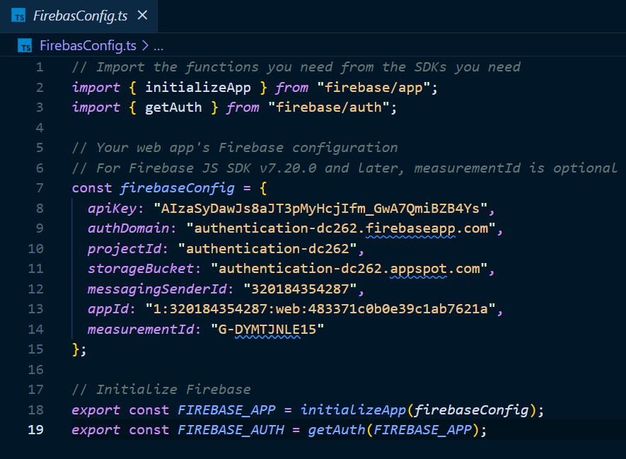
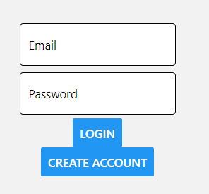
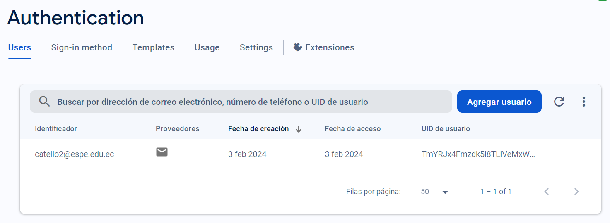

# Actividad Práctica 9: Implementación de Autenticación en una Aplicación React con Firebase

<aside>
📖 Universidad de las Fuerzas Armadas - ESPE

Realizado por: <br>
✅ Cristian Tello <br>
✅ Camila Morales <br>
✅ Antoni Toapanta <br>
4 de febrero de 2024  
🖥️ Desarrollo Web Avanzado - NRC: 14956<br>
🖥️ Docente: **Lcdo. Diego Medardo Saavedra García. Mgtr.**<br>
🖥️ Proyecto: [https://github.com/TelloCristian98/Auth-React-Firebase](https://github.com/TelloCristian98/Auth-React-Firebase)

</aside>

# React Aplication con Autenticación de Firebase

## INDICACIONES

Para inicializar la aplicación:

1. Ingresamos a la carpeta donde se encuentra el programa y desde la terminal ejecutamos el siguiente comando:

```
  npm install o npm i
```

Con esto, se cargarán las carpetas `node_modules`.

Finalmente, ejecutamos el siguiente comando en la terminal:

```
  npx expo start
```

Con esto ya deben estar corriendo el aplicativo web de manera local.

Finalmente, presionamos w para abrir la version web de la aplicación.

## Aplicativo Web

### Autenticación con Firebase

Para la autenticación con firebase creamos un nuevo proyecto en la consola de firebase y habilitamos la autenticación con firebase. En este caso se utilizó la verificación por correo electrónico.



### Configuración del Proyecto React

Para utilizar la autenticación de firebase en un proyecto React instalamos todas las depencias necesarias que se especifica en la documentación de firebase con el siguiente resultado:



Luego, configuramos el documento “FirebaseConfig.ts” y establecemos las variables para la autenticación.



### Comprobación de la Autenticación

Una vez que la aplicación se está ejecutando de manera local obtenemos la siguiente interfaz:



En esta interfaz podemos iniciar sesión y también crear una cuenta. Para iniciar, ingresamos un correo y una contraseña y creamos una cuenta. Luego, al autenticador de firebase enviará un correo de verificación y el nuevo usuario aparecera en la consola de firebase:



Con esto, solo el usuario que esté registrado y autentificado con firebase podrá iniciar sesión.
